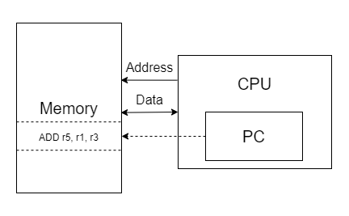
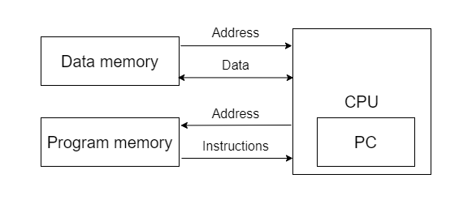

# Базовая информация про Interconnect

## Содержание

- [Базовая информация про Interconnect](#базовая-информация-про-interconnect)
  - [Содержание](#содержание)
  - [Введение](#введение)
  - [Теоретическая часть](#теоретическая-часть)
    - [Пример с подключением памяти](#пример-с-подключением-памяти)
    - [Системная шина](#системная-шина)
    - [On-chip интерконнект](#on-chip-интерконнект)
      - [Актуальность разработки системных шин](#актуальность-разработки-системных-шин)
      - [Mapping памяти](#mapping-памяти)
    - [Network-on-chip](#network-on-chip)
    - [Общая структура системной шины](#общая-структура-системной-шины)
      - [Компоненты системной шины](#компоненты-системной-шины)
      - [Виды топологий шин](#виды-топологий-шин)
    - [Структура общения на системной шине](#структура-общения-на-системной-шине)
      - [Интерфейс и протоколы](#интерфейс-и-протоколы)
      - [Общий случай handshake протокола](#общий-случай-handshake-протокола)
      - [Арбитраж Шин](#арбитраж-шин)
      - [Упрощенный пример типичной операции на шине](#упрощенный-пример-типичной-операции-на-шине)
  - [Практическая часть](#практическая-часть)

## Введение
В современном мире технологий, где вычислительные системы становятся все более мощными и компактными, эффективное взаимодействие между компонентами чрезвычайно важно для обеспечения оптимальной производительности.

Понимание `on-chip` интерконнекта становится все более критическим с увеличением сложности современных систем на кристалле (`SoC`). Интерконнект обеспечивает взаимодействие между ядрами процессора, кэш-памятью, периферийными устройствами и другими компонентами. При этом невозможно одинаково хорошо оптимизировать работу всех блоков. В зависимости от поставленной задачи проходится идти на разные компромиссы по оптимизации наиболее критически важных аспектов системы.

В качестве примера на рисунке приведена диаграмма типичного построения SoC.

 > Эффективное управление данной внутренней "магистралью" имеет самое прямое влияние на производительность и энергоэффективность микропроцессорных систем.

Участие в хакатоне по этому направлению позволяет вам погрузиться в мир оптимизации компьютерных систем на примере реальной задачи. В данном документе рассматриваются основные аспекты `on-chip` интерконнекта, позволяющие ввести в курс дела новичков, совершенно не имеющих представления об этой области. Если уверены в себе, можете переходит сразу к выполнению [задания](#задание).

## Теоретическая часть
### Пример с подключением памяти

Начнем немного издалека и зададимся вопросом, каким образом вообще подключаются два блока, в чем могут быть минусы такого подключения и что можно с этим сделать. Рассмотрим на примере подключения блока памяти и процессора.

В общем случае подключается через интерфейс вида `point-to-point`(`P2P`). Вспомним про два вида архитектуры памяти по внутреннему устройству: `Принстонскую` и `Гарвардскую`:

В `Принстонской` архитектуре, как известно, одно гомогенное пространство памяти.

Достаточно одного канала адреса для взаимодействия процессора с блоком памяти, из-за чего интерфейс связи крайне простой и быстрый (связь блоков напрямую).

В `Гарвардской` архитектуре разделенные каналы под доступ к памяти данных и инструкций. Таким образом, происходит дублирование всех сигналов канала. Интерфейс каналов не изменился, он продолжает обеспечивать столь же быструю передачу и продолжает отличаться простотой. **Однако**, число сигналов увеличилось пропорционально добавлению нового канала. Таким образом мы приблизились к пониманию **ключевого недостатка P2P связи — крайне дорогое масштабирование**.

Даже для построения простого микроконтроллера необходимо обеспечить связь:
- большого количества блоков SRAM;
- медленной памяти DRAM, Flash большой емкости;
- разнообразных периферийных блоков.

Сделать это, используя только `P2P` модель, **невозможно**.

> Таким образом, возникает необходимость в использовании такой связи, что позволила бы сократить издержки от масштабирования(увеличение числа используемых блоков) всей нашей системы - использование общей **системной шины**

### Системная шина

Системной шиной называют набор общих сигналов, к которому подключен один и более `IP-блок`.
**Cинхронная системна шина** состоит из следующих сигналов:
- Шина тактирования.
- Шина управления.
- Шина данных.
- Шина адреса.

На системной шине всегда есть инициатор всех транзакций — `Bus Master`(менеджер). в данном случае — `CPU`. Остальные же устройства принято называть `Slaves`(подчиненный), которые только реагируют на инициированные запросы.

Базово рассматриваются два вида интерконнектов:
  - `On-Chip` — обеспечивает взаимодействие блоков:
    - Процессор и процессор(общение нескольких ядер)
    - Процессор и `on-chip` память
    - Процессор и `IP-блоки`
  - `Оff-chip` — соединяет `off-chip` интерфейс cо следующими блоками:
    - `Off-chip` периферия
    - `Off-chip` память
    - `Off-chip` ASICs

В контексте задачи хакатона нас интересует именно внутренний, так называемый `On-Chip`, интерконнект, так что далее рассмотрим именно его специфику.

### On-chip интерконнект

В контексте рассмотрения `On-Chip` особенно интересны его следующе особенности:
- Пропускная способность — скорость распространения информации (байты/с).
- Задержка распространения — время между запросом и ответом, зависит от текущей задачи.
- Идея Master Slave — решает вопрос о том, кто задает транзакцию, а кто ее принимает.
- Необходимый параллелизм — отвечает за количество независимых каналов для передачи транзакций, работающих единовременно.
- Несколько тактовых доменов — необходимо, т.к. разные подключаемые IP блоки могут требовать разные частоты.

#### Актуальность разработки системных шин

Разработка современных систем на кристале сопряжена с рядом аспектов, под которые наша схема взаимодействия блоков (будь то P2, построение общей шины или что-либо еще) должны подстраиваться:
 - Гетерогенность — в современных системах разного класса применяется подход объединения различных узкоспециализированных компонентов в единую сеть.
 - Увеличение объема и разнообразия траффика от новых добавляемых гетерогенных блоков, работающих на своей скорости, со своими размерностями данных.
 - Технологически, уменьшение физических размеров соединительных проводов происходит медленнее, чем уменьшение транзисторов/отдельных затворов.
 - С уменьшением технологического процесса задержка на процесс вычисления внутри отдельного гомогенного блока уменьшается, задержка же передачи данных между такими блоками начинает сильно увеличиваться.

В связи с обозначенными аспектами в разработке, с которыми разработчикам вычислительной системы приходится сталкиваться, возникает кратное повышение сложности соединительной логики, а в следствии и ее важность в вопросе построения процессорной системы в целом.
> Построение правильной архитектуры связи компонентов играет критическую роль в производительности всей системы, на нее приходится около 50% общего потребления энергии, а местами и больше. Является наибольшей частью от всего цикла проектирования.

Перед разработкой собственной архитектуры связи необходимо ответить на три ключевых вопроса:
- Вид топологии — как блоки системы будут связаны между собой (общая шина, некоторая иерархическая структура, кольца, сетки и т.п.).
- Используемый протокол взаимодействия — как будет происходить управление подключенных блоков, арбитраж между ними в случае наличия нескольких `Master` устройств.
- Отображение — каким образом относительно друг друга разные компоненты будут расположены (часто взаимодействующие между собой компоненты логично разместить рядом, нужно понять, какие из блоков таковыми будут, а также, что необходимо разместить на одной шине, а что можно разместить на другой, соединив обе общим [bridge-м](#общая-структура-системной-шины)).

#### Mapping памяти

Было отмечено, что использование системной шины для связи между множеством блоков предпочтительно по эффективности по сравнению с прямым соединением P2P, которое требовало бы дублирования сигналов для каждого блока.

Но так ли много действительно удалось сэкономить при подключении блоков к общей шине? К примеру, все еще нужно как-то выбирать `Slave` устройство и определять, в какой момент оно готово к обработке транзакции. Таким образом, получается, что необходимо вести к каждому устройству по отдельной линии выбора устройства и  получения сигнала о его готовности к обработке нового запроса. В результате выходит, что не слишком уж и сильно удается повысить эффективность системы — однако в этот момент в игру входит `Memory mapping`.

`Mapping` памяти в системах на кристалле позволяет унифицировать доступ к памяти, используя единое адресное пространство по обращению к каждому из устройств.

Таким образом, нет необходимости в том, чтобы создавать дополнительные соединительные линии, можно использовать прежний канал адреса для обращения к **любому** из подключенных в систему устройству.

Известно, что n-битная шина поддерживает 2n уникальных байтовых адресов. При этом для подавляющего большинства задач лишь малая часть от этих адресов необходима для хранения  данных. Таким образом, каждому подключенному устройству можно выделить свой набор адресов в памяти, при обращении `Master` устройства к которым, будет происходить обращение непосредственно к выбранному устройству.

Для примера, регистрам периферии выдаются адреса в разделе системной памяти (показан на рисунке выше).

Такая концепция позволяет в значительной мере решить проблему унификации и достичь высокой масштабируемости системы, тем самым окончательно решив основную проблему `P2P` связи!

> Благодаря `mapping` памяти достаточно трех компонент **(адрес, данные и управление)**, чтобы обеспечить обработку львиной доли запросов передачи данных и контроля над ними.

### Network-on-chip

`Network-on-chip` (`NoC`) предлагает собой альтернативную модульную платформу с высокой масштабируемостью. NoC поддерживает эффективную внутрикристальную связь, что позволяет создавать многопроцессорные архитектуры на базе NoC с высоким функциональным разнообразием и структурной сложностью. Это делает его де-факто стандартом связи на кристалле для высокоинтегрированных архитектур SoC. Кроме того, NoC поддерживает параллельные (множественные, одновременные) коммуникации, обеспечивая конвейерную обработку независимо от размера сети. Кроме того, вместо того, чтобы устанавливать соединение между всеми IP-блоками, в NoC сеть создается внутри чипа. Это позволяет каждому IP функционировать как сетевой узел. Например, чтобы обеспечить эффективную связь, используется сеть маршрутизаторов для соединения связанных с ними огромных ядер. В связи с этим шина в SoC заменена сетью маршрутизаторов, контролирующей процесс связи между узлами установленной сети. Исходя из этого, NoC обладает рядом характеристик, таких как низкая задержка, высокая пропускная способность и масштабируемость.

В NoC соединения организованы соответствующим образом для формирования соответствующих топологий. Примеры топологий:

- Ring
- Octagon
- Star
- 4x4 mesh
- 4x4 torus
- 4x4 folder torus
- butterfly
- binary tree
- fat tree

При этом связь в нем обычно происходит между IP-ядрами и в соответствии с используемой топологией. Также этого можно добиться с помощью асинхронного или синхронного режимов. Таким образом, в этих топологиях для маршрутизации пакетов между узлами можно использовать определенные методы маршрутизации. Для маршрутизации пакетов необходимы такие компоненты, как маршрутизаторы и каналы (связующие каналы). Примечательно, что некоторые методы маршрутизации специально предназначены для NoC, они хорошо спроектированы и не приводят к взаимной блокировке.

|                | Power Dissipation | Operation Frequency | Total area        |
| -------------- | ----------------- | ------------------- | ----------------- |
| Shared bus     | θ($n\sqrt{n}$)    | θ($1/n^2$)          | θ($n^3\sqrt{n}$)  |
| Segmented bus  | θ($n\sqrt{n}$)    | θ($1/n$)            | θ($n^2\sqrt{n}$)  |
| Point-to-Point | θ($n\sqrt{n}$)    | θ($1/n$)            | θ($n^2\sqrt{n}$)  |
| NoC (Mesh)     | θ($n$)            | θ($1$)              | θ($n$)            |

### Общая структура системной шины
Рассмотрим теперь подробнее структуру системной шины.

В общем случае структура шины с одним `Master` без арбитража и мостов (`bridge`) выглядит следующим образом:

Алгоритм работы системной шины:

  - `Master` устанавливает запрос к `Slave`, выставляя соответствующее значение по каналу адреса, отдельно выставляет данные и управляющие сигналы.
  - **Декодер** со значения на канале адреса от `Master` определяет, к какому `Slave` инициировано обращение, и соответствующим образом разрешает работу нужного устройства.
  - Данные подводятся ко всем устройствам, однако **разрешение на работу с ними декодер выдает только конкретному**.
  - Декодер выставляет управляющий сигнал на мультиплексор, чтобы **пропустить данные от нужного устройства** обратно на `Master` в момент, когда те будут готовы для передачи от нужного `Slave`.

#### Компоненты системной шины
Среди ключевых структурных компонентов, ответственных за работу системной шины, можно выявить следующие:
 - **`Master`** — инициирует передачу транзакций на чтение/запись. Система может содержать несколько `Master`-ов.
 - **`Slave`** — не инициирует передачу и только отвечает на входящие запросы. Система может содержать несколько `Slave`-ов.
 - **Декодер** — своего рода регулировщик, определяет устройство, которое будет обрабатывать передачу.
 - **`Bridge`** (мост) — соединяет шины разных типов (отличающихся по интерфейсу) и тем самым обеспечивает возможность общаться к устройствам из разных шин. Один конец `bridge` будет `Master`, а другой `Slave`.
 - **Арбитр** — возникает при наличии нескольких `Master` на шине и определяет очередность доступа этих `Master` к шине.

#### Виды топологий шин
Как уже упоминалось, перед разработкой собственной архитектуры связи необходимо ответить на несколько вопросов, один из которых заключается в выборе топологии всей системы, среди них можно выявить следующие:

**Shared Bus (Общая шина):**
- Все компоненты разделяют один  набор сигналов — единый интерфейс подключения.
- Только одна транзакция может существовать на шине единовременно.
- Можно разорвать шину на несколько иерархических кусков, чтобы поддерживать несколько единовременных транзакций.

**Кольцо:**
- Дешевый тип соединения (подключение только к соседям).
- Большая задержка распространения (`propagation delay`) при необходимости доступа `Master` к диаметрально расположенному `Slave` (`worst case` сценарий).
- Хорошо показывает себя при обработке транзакций, пришедших с соседних нод.
- Возможность обработки нескольких единовременных транзакций, задачу решает арбитр.

**Crossbar**
- P2P соединение между всеми нодами. По сути, является непосредственно развитием этой формы связи.
- Очень большая пропускная способность, но дорогое соединение по ресурсам площади и энергопотребления.
- Плохо масштабируется, крайне тяжело в готовую систему добавить еще одного `Master`/`Slave`.
- Может быть сведен к сокращенному `crossbar`-у/матрице.

### Структура общения на системной шине
#### Интерфейс и протоколы
Для установки общения блоков системы необходимо определиться с двумя основными аспектами:
> - **Интерфейс взаимодействия** — набор пинов и проводов, соединяющих компоненты (физическое соединение). В контексте общей шины определяет ее общий набор сигналов. Могут быть как синхронными, так и асинхронными.
> - **Протокол** — набор правил передачи данных ("язык" общения различных блоков), определяет очередность выставление сигналов, их значение и т.п.

Один интерфейс может работать с разными протоколами, это не что-то взаимоисключающее, но работающее очень часто совместно. К примеру, можно вспомнить спецификацию `AXI` `AMBА`, в которой  `AXI-4` рассматривается не только как совокупность сигнальных линий — интерфейсная составляющая, но и как набор правил, согласно которым будет организовываться передача — протокольная составляющая. С небольшой выкладкой истории развития семейства стандартов `AMBA` можно ознакомиться [тут](./AXI.md#развитие-amba).

Отдельно стоит отметить, что управление потоком происходит благодаря идеи `handshake`, согласно которой данные передаются только в момент, когда готов и получатель, и отправитель. `ack` и `nack` используются для установки подтверждения готовности. `Master` инициирует передачу, `Slave` отвечает на нее.
#### Общий случай handshake протокола
Необходимость такого протокола появляется в условиях наличия ряда зависимых устройств на шине. Позволяет установить гарантийную передачу данных между выбранными устройствами. Далее приводится работа протокола в общем виде, не стоит путать эту модель с протоколом, используемым в спецификации `AXI` `AMBA`, подробнее о которой можно прочитать [тут](./AXI.md#handshake). Непосредственно в спецификации в рамках него накладываются дополнительные ограничения, идея же остается неизменной.

Концептуально протокол включает два сигнала:
- `ENQ`(`enquiry`) — выставляется отправителем, чтобы инициировать передачу. держится до тех пор, пока передача не будет начата и закончена.
- `ACK`(`acknowledge`) — выставляется получателем, когда тот готов получать данные.

При выставленных `ENQ` и `ACK` передача начинается, по получении данных `ACK` опускается, и только после чего опускается `ENQ`.
#### Арбитраж Шин
Как было сказано, лишь один `Master` может управлять шиной. На шине может находится сразу несколько таких устройств (несколько `CPU`, `CPU`+`DMA` и т.д.), из чего следует следующее:
- Требуется время, чтобы определить, кто есть `Master` в определенный момент.
- Необходимо быть уверенным, что выбранному `Master`-у отвечают правильные `Slaves`.

Для решения этих задач используется **арбитр шины**.

Схема арбитража может быть как со случайным выбором `Master` устройства, так и `Priority-based`, `Round Robin`, `Time Division Multiplexng`(`TDMA`) и другие.
Схема декодирования позволяет выбрать `Slave` устройства для передачи, инициированной устройством `Master`. Также указывает, какому из `Slave` устройств разрешено выставить данные на шину в текущий момент, а какому нет.

Далее приведен пример системы с несколькими `Master` на одной шине. Как можно заметить, арбитр управляет рядом мультиплексоров, достаточных, для комутации всех `Master` устройств.

#### Упрощенный пример типичной операции на шине
Рассмотрим абстрактный алгоритм осуществления транзакций, применимый для любого протокола серии `AXI`:

1. `Master` выбирает один `Slave` (периферийное устройство, регистр и т.п. доступного из адресного пространства), выставляя соответствующий **адрес** на шину адреса.
- В этот же момент выставляются **управляющие сигналы** ( указывают размер передачи, чтение/запись будет происходить и т.п. ).
2. `Master` ждет **ответ** от `Slave`. Как только `Slave` готов, начинается отправка запрашиваемых данных в `Master`.
- В этот же момент отправляется сигнал `Ready`, тем самым сообщается `Master`-у, что данный `Slave` готов принять следующий запрос.
3. `Master` читает переданные данные и начинает следующий цикл.

Ознакомиться с формированием транзакций записи и чтения на примере AXI-Lite можно [тут](./AXI.md#каналы-для-транзакции-записи).

## Практическая часть
Для перехода к заданию этого трека можно воспользоваться [этой ссылкой](/README.md#задание).
