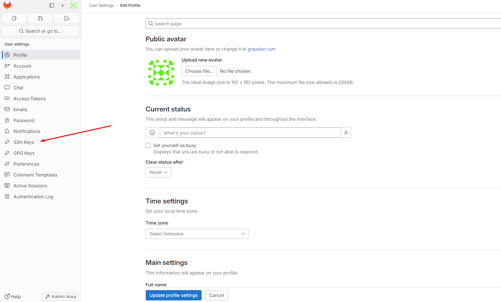

# Руководство по работе с GitLab

## Введение

Данное руководство написано для участников хакатона MIET-SoCDesignChallenge 2024 RTL трека, с помощью него вы можете узнать ответы на свои вопросы по базовой работе с GitLab.
## Оглавление
- <a href="#connectSSH">SSH ключи</a>
- <a href="#startWork">Начало работы с репозиторием</a>
- <a href="#createPrjLab">Работа с GitLab</a>
- <a href="#gitbranch">Ветвление</a>
- <a href="#gitcommit">Ведение комитов</a>
- <a href="#pull">Pull командa</a>
- <a href="#gitcomm">Другие базовые Git команды</a>
   - <a href="#gitadd">Добавление отдельных файлов или всех файлов в область подготовленных файлов</a>
   - <a href="#gitstatus">Проверка статуса репозитория</a>
   - <a href="#gitcomit2">Внесение изменений однострочным сообщением или через редактор</a>
   - <a href="#gitlog">Просмотр истории коммитов с изменениями</a>
   - <a href="#gitshow">Просмотр заданного коммита</a>
   - <a href="#gitdiff">Просмотр изменений до коммита</a>
   - <a href="#gitrm">Удаление отслеживаемых файлов из текущего рабочего дерева</a>
   - <a href="#gitreset">Отмена подготовленных и неподготовленных изменений</a>
   - <a href="#gitamend">Изменение последнего коммита</a>
   - <a href="#gitrevert">Откат последнего коммита</a>
   - <a href="#gitbranch2">Просмотр списка веток</a>
   - <a href="#gitdelete">Удаление ветки</a>
   - <a href="#gitmerge">Слияние двух веток</a>
   - <a href="#gitloggr">Отображение журнала фиксации в виде графика для текущей или всех веток</a>
   - <a href="#gitabort">Прекращение слияния при конфликте</a>
   - <a href="#gitmergerepo">Слияние удалённого репозитория с локальным</a>

<div id='connectSSH'>

## SSH ключи
При первом подключении на сервер необходимо выполнить все последующие шаги.
Приблизительное время настройки - 10 минут.

- Сначала **сгенерируем ssh ключ**. В терминале Linux прописываем команду, чтобы сгенерировать SSH-ключ:
```
ssh-keygen
```
- На все дальнейшие запросы нажимаем Enter, ничего более не вводя. В терминал выдаст текст, похожий на рисунок снизу.

<div align="center">


</div>
<details>
<summary>Что такое SSH ключ?</summary>

Мы сгенерировали SSH-ключ. Он нужен, чтобы получить доступ к проектам на GitLab со своего компьютера и выполнять команды без постоянного ввода пароля, нужно, чтобы сервер нас узнавал.

</details>

- Чтобы вывести на экран сгенерированный ключ, введём следующую команду:

```
$ cat ~/.ssh/id_rsa.pub
```

Важно, чтобы был скопирован именно **публичный SSH-ключ**, он отличается от приватного наличием "`.pub`" в конце!

После выполнения команды в терминале вы увидите длинную строку:
```
$ ssh-rsa <последовательность символов ключа>
```

- Этот ключ необходимо добавить в GitLab. Полностью выделяйте и копируйте его. Буфер обмена между удаленным рабочим столом и локальным компьютером должен работать. При возникновении проблем убедитесь, что на локальном компьютере у вас выбрана **английская раскладка**.


#### Как добавить SSH ключ в GitLab?
<br>

1. Нажмите на ваш аватaр в GitLab.
2. Зайдите в Edit Profile.

<div align="center">


</div>

<br>

- Оттуда нужно перейти в раздел "SSH keys".

<div align="center">


</div>

<br>

- Нажмите на кнопку "Add new key".

<div align="center">


</div>

<br>

- В поле Title вписывайте то, как вы хотите назвать машину, с которой работаете в данный момент.
- В поле Key вставьте скопированный публичный SSH-ключ. 

<div align="center">


</div>


- Впишите следующие две команды для git на сервере:
```
$ git config --global user.name "<имя пользователя>"
$ git config --global user.email <почта пользователя>
```

Например:
```
$ git config --global user.name "John Doe"
$ git config --global user.email johndoe@example.com
```

<details>
<summary>Зачем я прописал что-то в git config?</summary>

Нам необходимо указать имя и адрес электронной почты. Это важно, потому что каждый ваш коммит в Git содержит эту информацию, и она не может быть далее изменена.
</details>

<div id='startWork'>

## Начало работы с репозиторием

После процедур с SSH ключами мы можем создавать и редактировать файлы из интерфейса GitLab или склонировать репозиторий и работать с ним со своего локального устройства.

Для доступа к заданию участникам доступен **эталонный репозиторий** от организаторов. В нем расположено задание трека. 

Для каждой команды созданы **приватные репозитории**. Они сейчас пустые. 

Для того чтобы начать выполнять задание, необходимо перенести содержимое эталонного репозитория в командный и работать над ним там. 

Для проверки в конце хакатона жюри будет проверять решение, выложенное в командном репозитории.

- **Далее один человек из команды должен склонировать эталонный репозиторий.**

<details>

<summary> Что такое клонирование репозитория? </summary>

Клонирование репозитория GitLab - это процесс создания локальной копии удаленного репозитория GitLab на вашем компьютере. Это позволяет вам работать с кодом проекта локально, вносить изменения и взаимодействовать с удаленным репозиторием для обмена изменениями с другими участниками проекта.
</details>

В GitLab лежит главный (`RTL/rtl2024`) и ваш командный (`RTL/<название команды>/hack2024`) репозитории, первый необходимо склонировать на удаленный сервер. Для этого найдите его и нажмите на название:


Скопируйте ссылку на репозиторий, как показано на рисунке ниже:

<div align="center">


</div>

<br>

Введите в терминал на сервере следующие команды:
```
$ cd ~/
$ git clone <скопированная ссылка>
```

- Перейдите в скаченный репозиторий.
```
$ cd rtl_2024
```
- Скопируйте url ссылку вашего командного репозитория на GitLab и на сервере в рабочей директории `/rtl_2024` введите в терминал:
```
$ git remote set-url origin <ссылка>
```
- После этого введите команду: 

```
$ git checkout -b develop
```
- И потом:
```
$ git push -u origin develop
```
Вы можете вернуться в GitLab в ваш командный репозиторий и обнаружить в нем все новые файлы, необходимые для работы.

**Готово, вы находитесь в скаченном репозитории, с которым вольны делать, что вам захочется. Успехов!**

<div id='createPrjLab'>

## Работа с GitLab

Следующие разделы несут справочную информацию по работе с GitLab и Git командами.


GitLab - это веб-платформа для управления Git-репозиториями, которая предоставляет инструменты для совместной работы над проектами, управления кодом и автоматизации процессов разработки. Он предоставляет широкий спектр функций, включая систему управления задачами, интеграцию с инструментами Continuous Integration/Continuous Deployment (CI/CD), возможности отслеживания ошибок (issue tracking).

Некоторые ключевые особенности GitLab:

- Управление репозиториями: GitLab предоставляет пользовательский интерфейс для создания, просмотра и управления Git-репозиториями. Вы можете создавать новые проекты, добавлять и удалять репозитории, просматривать историю коммитов и многое другое.

- Коллаборация: GitLab облегчает совместную работу над проектами. Пользователи могут добавлять задачи, создавать ветки для новых функций, оставлять комментарии к коду и запрашивать обзоры кода для проверки изменений другими участниками команды.

- Управление задачами и ошибками: GitLab включает систему управления задачами, которая позволяет отслеживать и управлять задачами и ошибками в проекте. Вы можете создавать задачи, назначать их участникам команды, отслеживать их статус и привязывать к ним коммиты.

Работа со своим репозиторием в GitLab включает в себя создание новых проектов, управление репозиторием, добавление и коммит изменений, работу с ветками, совместную разработку, настройку CI/CD и многое другое. В следующих главах представлена инструкция по работе со своим репозиторием в GitLab.

<div id='gitbranch'>

## Ветвление


Ветвление в GitLab позволяет создавать и управлять отдельными линиями(ветками) разработки в рамках одного проекта. Это позволяет разработчикам работать над различными функциями или исправлениями ошибок параллельно, не влияя на основную ветку разработки (обычно `master` или `main`).

Вот подробное объяснение процесса ветвления в GitLab:

1. Создание новой ветки:
   - Перейдите на страницу проекта в GitLab.
   - На верхней панели нажмите на кнопку "Branches" (рисунок ниже)
   - Введите название новой ветки в поле "Create new branch" и выберите ветку, от которой вы хотите создать новую ветку (обычно это основная ветка, например, master или main).
   - Нажмите кнопку "Create branch".

   

2. Переключение на созданную ветку:
   - После создания ветки вы можете переключиться на нее, чтобы начать работу.

   - Чтобы в вашем локальном репозитории появилась созданная ветка, выполните следующие команды в командной строке на сервере:

   ```
   git pull
   git checkout <имя ветки>
   ```

     **Для того чтобы узнать, в какой ветке вы находитесь сейчас, выполните следующую команду:**

     ```
      git status
      ```


Также можно создать ветку из консоли на сервере, введя команду:

```
git branch <имя ветки>
```
и перейти в нее командой:

```
git checkout <имя ветки>
```

#### Работа в ветке:
   - Теперь вы можете вносить изменения в код, создавать новые файлы, выполнять коммиты и т. д., как обычно.
   - Ваши изменения будут сохраняться только в рамках текущей ветки и не будут влиять на основную ветку проекта или другие ветки.

- Запрос на слияние (Merge Request):
   - Когда вы закончите работу в ветке и захотите включить ваши изменения в основную ветку проекта, создайте запрос на слияние (Merge Request). Перейдите на страницу проекта в GitLab и выберите слева вкладку "Merge Requests" (рисунок ниже).
   
   - Нажмите на кнопку "New merge request".
   - Выберите ветки для слияния (ваша ветка и основная ветка) и нажмите кнопку "Compare branches and continue" (рисунок ниже).
   
   - Заполните информацию о запросе на слияние (описание, название, метки и т. д.) и нажмите кнопку "Submit merge request".

- Обсуждение и проверка кода:
   - После создания запроса на слияние другие участники команды могут просмотреть ваши изменения, оставить комментарии и предложения по улучшению кода.
   - Вы можете обсудить изменения, внести необходимые правки и обновить ваш запрос на слияние.

- Слияние изменений:
   - После того как ваш запрос на слияние будет принят и пройдет все необходимые проверки, вы можете выполнить слияние изменений в основную ветку проекта.
   - После слияния ваш код будет включен в основную ветку проекта и станет доступен для всех участников команды.

Ветвление в GitLab обеспечивает эффективное управление процессом разработки и позволяет разработчикам работать над разными частями проекта независимо друг от друга.

<div id='gitcommit'>

## Ведение коммитов 

Ведение коммитов в GitLab подобно ведению коммитов в любом другом Git-репозитории, но GitLab предоставляет дополнительные инструменты для упрощения этого процесса и интеграции коммитов с другими аспектами разработки. Вот общий процесс ведения коммитов в GitLab:

1. **Изменения в коде:**
   Разработчики вносят изменения в исходный код своего проекта на локальной машине.

2. **Добавление изменений:**
   После того как разработчики внесли необходимые изменения, они добавляют эти изменения в индекс Git с помощью команды:
```
git add .
```
   Если необходимо добавить конкретный файл и директорию, то можно сделать это с помощью команды:
```
git add <file/directory>
```

3. **Коммит изменений:**
   Затем разработчики создают коммиты, фиксирующие эти изменения с помощью команды:

```
git commit -m "Your short summary about the commit"
```

   Каждый коммит должен иметь ясное и информативное сообщение о том, что было изменено или добавлено.

4. **Публикация изменений:**

   После создания коммитов разработчики публикуют их в удаленный репозиторий GitLab с помощью команды:
```
git push origin master
```
   Замените master на имя вашей ветки, если вы работаете в другой ветке.

   Это отправляет все новые коммиты в ваш удаленный репозиторий, где они становятся доступными для других участников команды.

   **Перед "пушем" коммита, убедитесь, что вы находитесь в нужной ветке.**

   Чтобы узнать, в какой ветке вы находитесь в Git, выполните команду:

```
git status
```
5. **Обзор кода:**
   После публикации коммитов другие члены команды могут просмотреть изменения и оставить комментарии или отзывы о коде с помощью функции обзора кода GitLab.

<div id='pull'>

## Pull командa

Команда `git pull` в GitLab используется для получения последних изменений из удаленного репозитория и автоматического объединения их с локальной версией текущей ветки. **Это позволяет вам обновлять вашу локальную копию кода до самой последней версии, которая была отправлена в удаленный репозиторий.**

Вот как использовать команду `git pull`:

1. Перейдите в ваш рабочий каталог: откройте терминал или командную строку и перейдите в каталог вашего проекта.

2. Выполните команду `git pull`: просто выполните команду `git pull` без каких-либо дополнительных аргументов. Это заставит Git извлечь изменения из удаленного репозитория и объединить их с вашей локальной копией кода.

   Пример:
```
git pull
```
3. Ожидайте завершения операции: Git выполнит операцию извлечения и слияния изменений из удаленного репозитория. Если есть новые изменения, они будут загружены и автоматически объединены с вашим локальным кодом.

При использовании команды `git pull` может возникнуть слияние изменений, если в вашем локальном репозитории есть локальные изменения, которых нет в удаленном репозитории. В этом случае Git попытается автоматически объединить изменения, но, если возникнут конфликты, вам придется их разрешить вручную.

<div id='gitcomm'>

## Другие базовые Git команды 


Git - это распределенная система управления версиями, которая используется для отслеживания изменений в исходном коде и координации работы нескольких разработчиков над одним проектом. Разработан Линусом Торвальдсом в 2005 году, Git быстро стал одним из самых популярных инструментов разработки программного обеспечения благодаря своей скорости, эффективности и гибкости.

Основные концепции Git включают в себя:

- **Репозиторий (Repository):** Это хранилище всех файлов, истории изменений и метаданных проекта. Репозиторий может быть локальным (на вашем компьютере) или удаленным (на сервере).

- **Коммиты (Commits):** Коммиты представляют собой снимки состояния проекта в определенный момент времени. Они содержат изменения в файлах, а также метаданные, такие как автор коммита, дата и время.

- **Ветвление (Branching):** Ветвление позволяет разработчикам работать над различными версиями проекта параллельно. Каждая ветка представляет собой отдельную линию разработки, которая может быть объединена с другими ветками.

- **Слияние (Merging):** Слияние - это процесс объединения изменений из одной ветки в другую. Обычно используется для интеграции новых функций или исправлений ошибок в основную ветку проекта.

- **Удаленные репозитории (Remote Repositories):** Удаленные репозитории находятся на удаленных серверах и используются для совместной работы нескольких разработчиков. Они позволяют обмениваться изменениями и синхронизировать работу между участниками проекта.

Git предоставляет обширный набор команд для управления версиями, слияния, ветвлений, анализа изменений и многих других операций, что делает его мощным инструментом для разработки программного обеспечения.

**Полное руководство о Git есть на официальном русскоязычном сайте:** https://git-scm.com/book/ru/v2

Ниже показаны с описанием базовые команды Git, которые могут вам потребоваться.

<div id='gitadd'>

### Добавление отдельных файлов или всех файлов в область подготовленных файлов

Добавить отдельный файл в область подготовленных файлов можно параметром **add** с указанием имени файла. Просто замените `somefile.sv` на актуальное имя.

```
git add somefile.sv
```
Кроме того, можно добавить все файлы и папки в эту область, предоставив wildcard `.` вместо имени файла:

```
git add .
```

<div id='gitstatus'>

### Проверка статуса репозитория

Просмотреть статус нужного репозитория можно по ключевому слову **status**: его действие распространяется на подготовленные, неподготовленные и неотслеживаемые файлы.

```
git status
```
<div id='gitcomit2'>

### Внесение изменений однострочным сообщением или через редактор

При создании коммита в репозитории можно добавить однострочное сообщение с помощью параметра `commit` с флагом `-m`. Само сообщение вводится непосредственно после флага, в кавычках.

```
git commit -m "Your short summary about the commit"
```

<div id='gitlog'>

### Просмотр истории коммитов с изменениями

Просматривать изменения, внесённые в репозиторий, можно с помощью параметра **log**. Он отображает список последних коммитов в порядке выполнения. Кроме того, добавив флаг `-p`, вы можете подробно изучить изменения, внесённые в каждый файл.

```
git log -p
```

<div id='gitshow'>

### Просмотр заданного коммита

Просмотреть полный список изменений, внесённых конкретным коммитом, можно с помощью параметра **show**, указав идентификатор или хеш коммита. Значение хеша уникально для каждого коммита, созданного в вашем репозитории.

```
git show 1af17e73721dbe0c40011b82ed4bb1a7dbe3ce29
```

<div id='gitdiff'>

### Просмотр изменений до коммита

Можно просматривать список изменений, внесённых в репозиторий, используя параметр **diff**. По умолчанию отображаются только изменения, не подготовленные для фиксации.

```
git diff
```
Для просмотра подготовленных изменений необходимо добавить флаг: `--staged`.

```
git diff --staged
```
Также можно указать имя файла как параметр и просмотреть изменения, внесённые только в этот файл:

```
git diff example.sv
```

<div id='gitrm'>

### Удаление отслеживаемых файлов из текущего рабочего дерева

Удалять файлы из текущего рабочего дерева можно с помощью параметра **rm**. При этом файлы удаляются и из индекса.

```
git rm dirname/example.sv
```
Можно также использовать маски файлов (например `*.sv`) для удаления всех файлов, соответствующих критерию.

```
git rm dirname/*.sv
```
<div id='gitreset'>

### Отмена подготовленных и неподготовленных изменений

Восстановить файлы рабочего дерева, не подготовленные к коммиту, можно параметром **checkout**. Для проведения операции требуется указать путь к файлу. Если путь не указан, параметр `git checkout` изменит указатель `HEAD`, чтобы задать указанную ветку как текущую.

```
git checkout example.sv
```
Восстановить подготовленный файл рабочего дерева можно параметром **reset**. Потребуется указать путь к файлу, чтобы убрать его из области подготовленных файлов. При этом не будет производиться откат никаких изменений или модификаций — однако файл перейдёт в категорию не подготовленных к коммиту.

```
git reset HEAD example.sv
```
Если нужно выполнить это действие для всех подготовленных файлов, путь к ним указывать не надо.

```
git reset HEAD
```
<div id='gitamend'>

### Изменение последнего коммита

Внести изменения в последний коммит можно параметром commit с флагом **--amend**. Например, вы записали изменения, внесённые в ряд файлов, и поняли, что допустили ошибку в сообщении коммита. В этом случае можете воспользоваться указанной командой, чтобы отредактировать сообщение предыдущего коммита, не изменяя его снимок.

```
git commit --amend -m "Updated message for the previous commit"
```

**Внимание!** Не изменяйте публичные коммиты.

С помощью **amend** прекрасно исправляются локальные коммиты, а исправления можно передать в общий репозиторий. Однако изменять коммиты, уже доступные другим пользователям, не следует. Помните, что изменённые коммиты являются совершенно новыми, а предыдущий коммит уже не будет доступен в текущей ветке. Последствия будут такими же, как при отмене изменений публичного снимка.

<div id='gitrevert'>

### Откат последнего коммита

Откатить последний коммит можно с помощью параметра **revert**. Создастся новый коммит, содержащий обратные преобразования относительно предыдущего, и добавится к истории текущей ветки.

```
git revert HEAD
```

### Разница между revert и reset

Команда `git revert` отменяет изменения, записанные только одним коммитом. Она не откатывает проект к более раннему состоянию, удаляя все последующие коммиты, как это делает команда `git reset`.

У команды `revert` есть два крупных преимущества по сравнению с `reset`. Во-первых, она не меняет историю проекта и производит операцию, безопасную для коммитов. Во-вторых, её объектом выступает конкретный коммит, созданный в любой момент истории, а `git reset` всегда берёт за точку отсчёта текущий коммит. К примеру, если нужно отменить старый коммит с помощью `git reset`, придётся удалить все коммиты, поданные после целевого, а затем выполнить их повторно. Следовательно, команда `git revert` — гораздо более удобный и безопасный способ отмены изменений.


Откатить проект до **заданного** коммита можно с помощью параметра revert и идентификатора коммита. Создастся новый коммит — копия коммита с предоставленным идентификатором — и добавится к истории текущей ветки.

```
git revert 1af17e73721dbe0c40011b82ed4bb1a7dbe3ce29
```
<div id='gitbranch2'>

###  Просмотр списка веток

Можно просматривать полный список веток, используя параметр **branch**. Команда отобразит все ветки, отметит текущую звёздочкой `(*)` и выделит её цветом.

```
git branch
```
Также можно вывести список удалённых веток с помощью флага `-a`.

```
git branch -a
```
<div id='gitdelete'>

### Удаление ветки

Удалить ветку можно параметром branch с добавлением флага `-d` и указанием имени ветки. Если вы завершили работу над веткой и объединили её с основной, можно её удалить без потери истории. Однако, если выполнить команду удаления до слияния — в результате появится сообщение об ошибке. Этот защитный механизм предотвращает потерю доступа к файлам.

```
git branch -d existing_branch_name
```
Для принудительного удаления ветки используется флаг `-D` с заглавной буквой. В этом случае ветка будет удалена независимо от текущего статуса, без предупреждений.

```
git branch -D existing_branch_name
```
Вышеуказанные команды удаляют только локальную копию ветки. В удалённом репозитории она может сохраниться. Если хотите стереть удалённую ветку, выполните следующую команду:

```
git push origin --delete existing_branch_name
```

<div id='gitmerge'>

### Слияние двух веток

Объединить две ветки можно параметром **merge** с указанием имени ветки. Команда объединит указанную ветку с основной:

```
git merge existing_branch_name
```
Если надо выполнить коммит слияния, выполните команду `git merge` с флагом `--no-ff`:

```
git merge --no-ff existing_branch_name
```
Указанная команда объединит заданную ветку с основной и произведёт коммит слияния. Это необходимо для фиксации всех слияний в вашем репозитории.

<div id='gitloggr'>

### Отображение журнала фиксации в виде графика для текущей или всех веток

Просмотреть историю коммитов в виде графика для текущей ветки можно с помощью параметра **log** и флагов `--graph --oneline --decorate`. Опция `--graph` выведет график в формате ASCII, отражающий структуру ветвления истории коммитов. В связке с флагами `--oneline` и `--decorate`, этот флаг упрощает понимание того, к какой ветке относится каждый коммит.

```
git log --graph --oneline --decorate
```
Для просмотра истории коммитов по всем веткам используется флаг `--all`.

```
git log --all --graph --oneline --decorate
```

<div id='gitabort'>

### Прекращение слияния при конфликте

Прервать слияние в случае конфликта можно параметром merge с флагом **--abort**. Он позволяет остановить процесс слияния и вернуть состояние, с которого этот процесс был начат.

```
git merge --abort
```
Также при конфликте слияния можно использовать параметр **reset**, чтобы восстановить конфликтующие файлы до стабильного состояния.

```
git reset
```
<div id='gitmergerepo'>

###  Слияние удалённого репозитория с локальным

Слияние удалённого репозитория с локальным выполняется параметром `merge` с указанием имени удалённого репозитория.

```
git merge origin
```
