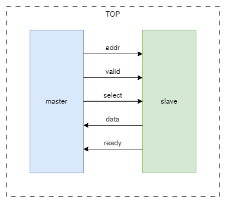

# parameter, package и interface в SystemVerilog

В данном руководстве рассказывается о некоторых конструкциях SystemVerilog, которые сильно упрощают разработку цифровых микросхем.

## Содержание
-  [Введение](#intro)
-  [Конструкции языка](#constr)
   - [parameter](#param)
   - [package](#pack)
   - [interface](#intf)

<div id='intro'>

## Введение

Представим, что вам необходимо связать между собой два модуля, которые будут обмениваться данными по следующей схеме:



SystemVerilog описание всего этого будет выглядеть примерно так:

```verilog
module master(
  input        clk_i,
  input        rstn_i,

  output [7:0] addr_o,
  output       valid_o,
  output       select_o,

  input  [7:0] data_i,
  input        ready_i
);
// внутренняя структура модуля
endmodule
```
```verilog
module slave(
  input        clk_i,
  input        rstn_i,

  input  [7:0] addr_i,
  input        valid_i,
  input        select_i,

  output [7:0] data_o,
  output       ready_o
);
// внутренняя структура модуля
endmodule
```
```verilog
module top(
  input clk_i,
  input rstn_i
);

  logic [7:0] addr;
  logic [7:0] data;
  logic       valid;
  logic       ready;
  logic       select;

  master master_inst (
    .clk_i       ( clk_i  ),
    .rstn_i      ( rstn_i ),
    .addr_o      ( addr   ),
    .valid_o     ( valid  ),
    .select_o    ( select ),
    .data_i      ( data   ),
    .ready_i     ( ready  )
  );

  slave slave_inst (
    .clk_i       ( clk_i  ),
    .rstn_i      ( rstn_i ),
    .addr_i      ( addr   ),
    .valid_i     ( valid  ),
    .select_i    ( select ),
    .data_o      ( data   ),
    .ready_o     ( ready  )
  );
endmodule
```
## Конструкции языка
<div id='constr'>

<div id='param'>

### parameter

Что, если мы внезапно захотим изменить разрядность шины адреса? В вышеприведенном примере нам нужно будет изменить её в трех разных строчках кода. Если бы, к примеру, slave модулей было больше, количество строчек, требующих изменения тоже бы возросло. В этой ситуации очень легко ошибиться, забыв изменить разрядной в одной из строк.

Здесь нам на помощь приходит `parameter` (подробнее о параметрах в Verilog можно почитать [здесь][parameters], в SystemVerilog они работают так же). Его можно объявлять в шапке модуля, передавая при инстанцировании. Давайте введем два параметра:

 - `ADDR_W` - address width, ширина шины адреса
 - `DATA_W` - data width, ширина шины данных

Эти параметры будут передаваться в master и slave и позволят конфигурировать их при инстанцировании. Теперь описание модулей будет выглядеть так:

```verilog
module master #(
  parameter ADDR_W = 8,  // ширина шины адреса по умолчанию = 8
  parameter DATA_W = 8   // ширина шины данных по умолчанию = 8
)(
  input                 clk_i,
  input                 rstn_i,

  output [ ADDR_W-1:0 ] addr_o,
  output                valid_o,
  output                select_o,

  input  [ DATA_W-1:0 ] data_i,
  input                 ready_i
);
// внутренняя структура модуля
endmodule
```
```verilog
module slave #(
  parameter ADDR_W = 8,  // ширина шины адреса по умолчанию = 8
  parameter DATA_W = 8   // ширина шины данных по умолчанию = 8
)(
  input                 clk_i,
  input                 rstn_i,

  input  [ ADDR_W-1:0 ] addr_i,
  input                 valid_i,
  input                 select_i,

  output [ DATA_W-1:0 ] data_o,
  output                ready_o
);
// внутренняя структура модуля
endmodule
```
```verilog
module top(
  input clk_i,
  input rstn_i
);

  // localparam - то же, что и parameter, но локальный
  // для модуля, в котором он объявляется
  localparam ADDR_W = 8;
  localparam DATA_W = 8;

  logic [ ADDR_W-1:0 ] addr;
  logic [ DATA_W-1:0 ] data;
  logic                valid;
  logic                ready;
  logic                select;

  master #(
    .ADDR_W      ( ADDR_W ),
    .DATA_W      ( DATA_W )
  ) master_inst (
    .clk_i       ( clk_i  ),
    .rstn_i      ( rstn_i ),
    .addr_o      ( addr   ),
    .valid_o     ( valid  ),
    .select_o    ( select ),
    .data_i      ( data   ),
    .ready_i     ( ready  )
  );

  slave #(
    .ADDR_W      ( ADDR_W ),
    .DATA_W      ( DATA_W )
  ) slave_inst (
    .clk_i       ( clk_i  ),
    .rstn_i      ( rstn_i ),
    .addr_i      ( addr   ),
    .valid_i     ( valid  ),
    .select_i    ( select ),
    .data_o      ( data   ),
    .ready_o     ( ready  )
  );
endmodule
```

<div id='pack'>

### package

Представим ситуацию, в которой необходимо будет передавать в модули большое количество параметров, причем некоторые параметры будут зависеть от других. Можно, конечно, все параметры задать локально в топовом модуле, но если мы, к примеру, хотим закрыть от других пользователей его содержимое, но сохранить возможность его конфигурировать?

В данном случае будет полезен `package`. Это структура, которая позволяет хранить и передавать данные, методы и параметры. В разные модули параметры из `package` можно добавить с помощью `import`.

> ВАЖНО: package должен быть скомпилирован ДО всех модулей, иначе при импортировании его содержимого в модуль возникнет ошибка.

Более подробно о package в SystemVerilog можно почитать [здесь][packages]

```verilog
package my_pkg;
  parameter SLV_MEM_D = 256;                 // глубина памяти slave,
                                             // от неё зависит разрядность адреса
  parameter ADDR_W    = $clog2(SLV_MEM_D);   // об этой функции ниже
  parameter DATA_W    = 8;
endpackage
```
```verilog
// master и slave не изменились

module top(
  input clk_i,
  input rstn_i
);

  import my_pkg::*; // импорт всего, что объявлено в my_pkg

  logic [ ADDR_W-1:0 ] addr;
  logic [ DATA_W-1:0 ] data;
  logic                valid;
  logic                ready;
  logic                select;

  master #(
    .ADDR_W      ( ADDR_W ),
    .DATA_W      ( DATA_W )
  ) master_inst (
    .clk_i       ( clk_i  ),
    .rstn_i      ( rstn_i ),
    .addr_o      ( addr   ),
    .valid_o     ( valid  ),
    .select_o    ( select ),
    .data_i      ( data   ),
    .ready_i     ( ready  )
  );

  slave #(
    .ADDR_W      ( ADDR_W ),
    .DATA_W      ( DATA_W )
  ) slave_inst (
    .clk_i       ( clk_i    ),
    .rstn_i      ( rstn_i   ),
    .addr_i      ( addr_o   ),
    .valid_i     ( valid_o  ),
    .select_i    ( select   ),
    .data_o      ( data_i   ),
    .ready_o     ( ready    )
  );
endmodule
```

> ПРИМЕЧАНИЕ: про функцию $clog2() можно почитать [здесь][clog2]

<div id='intf'>

### interface

А теперь мы захотели подключить не один, а два модуля slave, а может и больше. Если в одном модуле будет инстанцироваться множество модулей, причем с подключением каждого отдельного порта, это будет не очень удобно для разработчика и снизит читаемость кода. Если же после этого необходимо будет изменить, добавить или удалить порты у подключаемых модулей, разработчик с большой вероятностью может ошибиться.

В этом случае нам пригодится `interface`. Эта конструкция позволяет сгруппировать несколько сигналов вместе и подключать их как один порт.
Более подробно об интерфейсах в SystemVerilog можно почитать [здесь][interfaces]

```verilog
package my_pkg;
  parameter SLV_MEM_D = 256;                 // глубина памяти slave,
                                             // от неё зависит разрядность адреса
  parameter ADDR_W    = $clog2(SLV_MEM_D);   // об этой функции ниже
  parameter DATA_W    = 8;
endpackage
```
```verilog
interface my_intf #(     // в интерфейс можно передавать парметры и сигналы
  parameter ADDR_W = 8,  // ширина шины адреса по умолчанию = 8
  parameter DATA_W = 8   // ширина шины данных по умолчанию = 8
)();

  logic [ ADDR_W-1:0 ] addr;
  logic                valid;

  logic [ DATA_W-1:0 ] data;
  logic                ready;

  modport master_port(
    output addr,
    output valid,

    input  data,
    input  ready
  );

  modport slave_port(
    input  addr,
    input  valid,

    output data,
    output ready
  );

endinterface
```
```verilog
module master #(
  parameter ADDR_W = 8,  // ширина шины адреса по умолчанию = 8
  parameter DATA_W = 8   // ширина шины данных по умолчанию = 8
)(
  input                 clk_i,
  input                 rstn_i,

  output                select_o,
  my_intf.master_port   intf
);
// внутренняя структура модуля
endmodule
```
```verilog
module slave #(
  parameter ADDR_W = 8,  // ширина шины адреса по умолчанию = 8
  parameter DATA_W = 8   // ширина шины данных по умолчанию = 8
)(
  input                 clk_i,
  input                 rstn_i,

  input                 select_i,
  my_intf.slave_port    intf
);
// внутренняя структура модуля
  assign intf.ready = 1'b1;  // пример обращения к сигналу из интерфейса
endmodule
```
```verilog
module top(
  input clk_i,
  input rstn_i
);
  import my_pkg::*; // импорт всего, что объявлено в my_pkg

  logic select;

  my_intf #(
    .ADDR_W ( ADDR_W ),
    .DATA_W ( DATA_W )
  ) interfaces ();  // инстанцирование интерфейса

  master #(
    .ADDR_W      ( ADDR_W     ),
    .DATA_W      ( DATA_W     )
  ) master_inst (
    .clk_i       ( clk_i      ),
    .rstn_i      ( rstn_i     ),
    .select_o    ( select     ),
    .intf        ( interfaces )   // при компиляции нужный модпорт
                                  // подключится автоматически
  );

  slave #(
    .ADDR_W      ( ADDR_W     ),
    .DATA_W      ( DATA_W     )
  ) slave_inst (
    .clk_i       ( clk_i      ),
    .rstn_i      ( rstn_i     ),
    .select_i    ( select     ),
    .intf        ( interfaces )   // при компиляции нужный модпорт
                                  // подключится автоматически
  );
endmodule
```

[parameters]:  https://www.chipverify.com/verilog/verilog-parameters
[interfaces]:  https://www.chipverify.com/systemverilog/systemverilog-interface-intro
[packages]:    https://www.chipverify.com/systemverilog/systemverilog-package
[clog2]:       https://www.chipverify.com/verilog/verilog-math-functions
