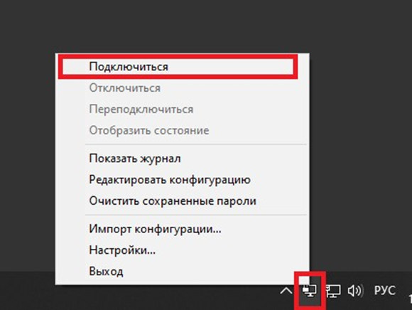
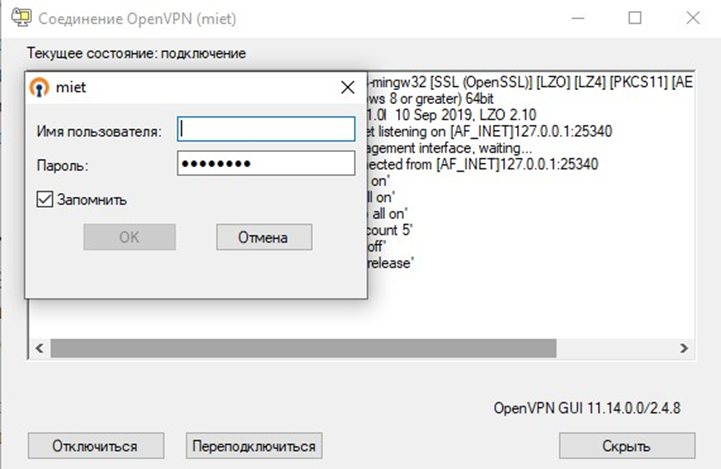
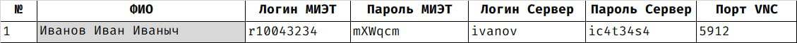
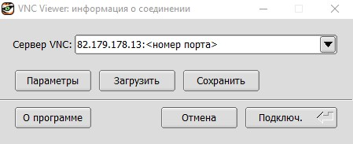
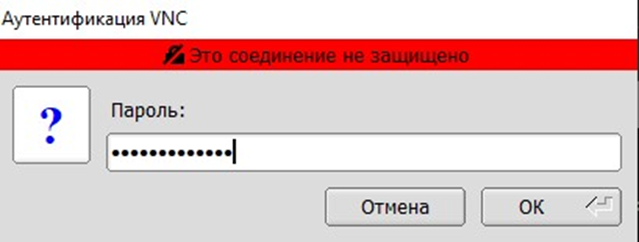
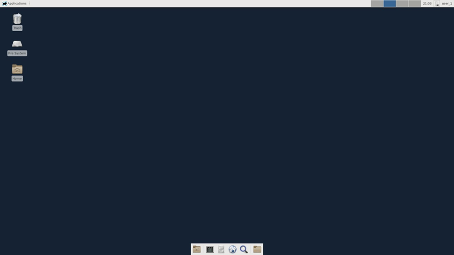
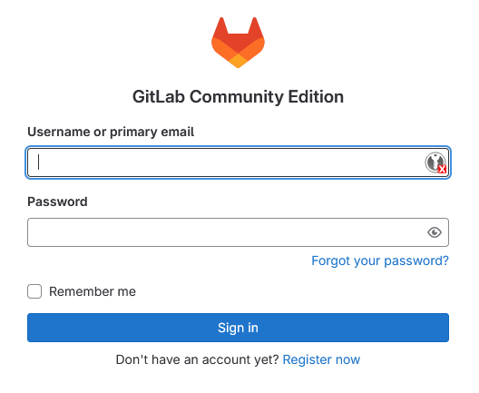

# Подключение к серверу (треки RTL и RTL pro)

## Ссылки на загрузку ПО

1. [TigerVNC viewer](https://sourceforge.net/projects/tigervnc/files/stable/1.13.1/vncviewer64-1.13.1.exe/download). TigerVNC (Virtual Network Computing) - это программное обеспечение для удаленного доступа и управления компьютером через сеть. Оно предоставляет возможность удаленного доступа к рабочему столу с использованием протокола VNC. Пользователь может подключаться к удаленному рабочему столу и управлять им, будто находится
перед ним.

1. [OpenVPN - MIET](https://vpn.miet.ru/). Эта ссылка ведет на гайд по установке VPN-сервера Московского Института Электронной Техники (МИЭТ). При подключении к VPN-серверу МИЭТ через эту ссылку, пользователь получает доступ к внутренней сети института, что позволяет использовать внутренние ресурсы, в данном случае он необходим для подключения к серверам хакатона, если вы пытаетесь зайти не из под внутренней сети МИЭТ.

## Как подключиться к VPN

> Подключение к VPN необходимо, если вы решили поработать из дома или раздали себе интернет с мобильного телефона, работая в МИЭТ.

Выберите иконку клиента OpenVPN в трее, нажмите по ней ПКМ и выберите "Подключиться".

Откроется окно как на картинке.

Если вы являетесь студентом МИЭТ, то введите свой логин-пароль от внутренних сервисов МИЭТ (ОРИОКС и так далее).

Если вы являетесь гостем, то вам необходимо ввести "Логин МИЭТ" и "Пароль МИЭТ" с листа, который вам выдали организаторы хакатона. Пример такого листа показан на рисунке ниже.

Нажмите "ОК".

> Обращаем ваше внимание на то, что с одной учетной записи VPN возможно только одно подключение одновременно. Если попытаться подключиться к VPN с двух устройств одновременно, то они будут "выбивать" друг друга из сети.

## Как подключиться к VNC

Запустите TigerVNC viewer.

Вам будет предложено ввести адрес сервера VNC для подключения.

Введите адрес `82.179.178.13:<ваш порт>`, как показано на картинке.

Порт VNC с вашим рабочим столом (4 цифры, например, `5912`) указан в листе бумаги с паролями.

Следующее окно предложит вам ввести пароль.

Введите "Пароль Сервер" с листа бумаги.

Успешное подключение к удалённой машине выглядит так:

## Как зайти на GitLab

Для организации совместной работы в рамках команд на хакатоне доступен сервер GitLab.

Перейдите [по ссылке](https://gitlab.soc-design-challenge.ru/).

Вам будет предложено ввести "Логин Сервер" и "Пароль Сервер" с листа бумаги.

В случае успеха вы попадёте на главное окно GitLab.

Дальнейшие указания по работе с GitLab вы получите от организаторов вашего трека.

## Для продвинутых пользователей

1. OpenVPN доступен для любой современной ОС, включая MacOS и GNU/Linux. Вы можете установить его на свой компьютер [по инструкции](https://vpn.miet.ru/).
2. Серверы также доступны по ssh: для трека RTL `ssh -p 26 <Логин Сервер>@82.179.178.13`, для трека RTL Pro `ssh -p 27 <Логин Сервер>@82.179.178.13`. Соответственно, вы можете использовать такие инструменты как `scp` и прочие.
