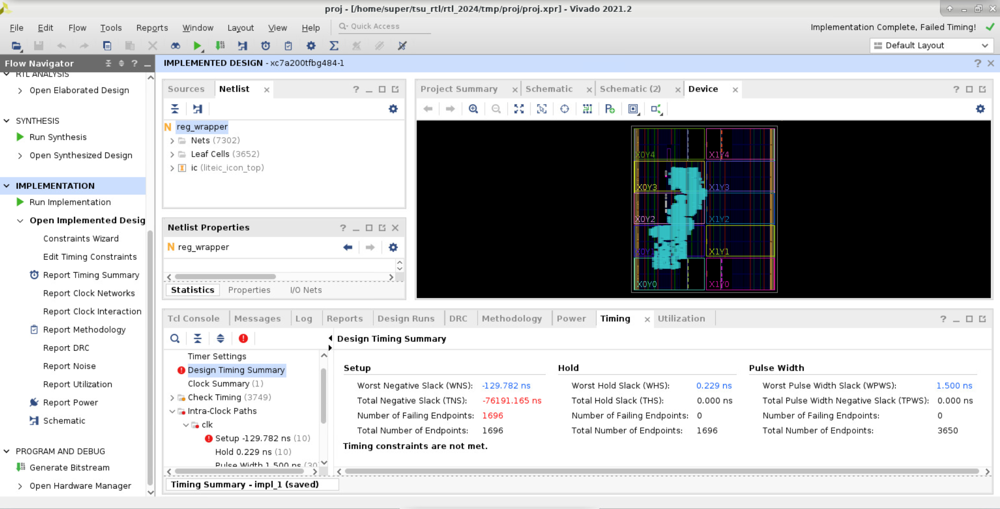

# Руководство по работе с САПРом Vivado

## Введение

Данное руководство написано для участников хакатона MIET-SoCDesignChallenge 2024 RTL трека, с помощью него вы можете узнать ответы на свои вопросы по базовой работе с графической оболочкой Vivado: начиная с создания проекта, заканчивая имплементацией и просмотром интересующих метрик.

## Оглавление
1. [Открытие Vivado и создание проекта](#createPrj)
2. [Начало работы](#start)
3. [Иерархия проекта в Vivado](#ierViv)
4. [Добавление нового файла в дизайн](#addSource)
5. [Удаление файла из дизайна](#deleteSource)
6. [Работа над ошибками](#debugErrors)
7. [Просмотр схемы RTL](#rtlScheme)
8. [Синтез](#synthesis)
9.  [Имплементация](#implemetation)
10. [Просмотр критического пути и slack](#ttx)
    * [Slack](#slack)
    * [FF & LUT](#FF&LUT)
    * [Подсчет тактовой частоты](#clk)


<div id='createPrj'>

## 1. Открытие Vivado и создание проекта ##

На сервере создание проекта поисходит командой ```make proj``` или ```make all``` в рабочей директории, подробнее о сборочных скриптах [здесь][scripts]


<div id='start'>

## 2. Начало работы ##
После завершения работы сборочного скрипта вы увидите gui Vivado (Рисунок 1)


##### Рисунок 1 Проект в gui Vivado ######

На рисунке пронумерованы рабочие области, на которые стоит обратить внимание:
1. Flow Navigator - вкладка с основным функционалом Vivado, здесь запускаются симуляции, синтез, имплементация, добавление/настройка IP блоков, добавление новых файлов, настройка самого проекта, его окружения и т.д (подробнее в разделах [8](#synthesis) и [9](#implemetation))
2. Вкладка с рабочим пространством проекта, здесь собраны все находящиеся файлы в рабочей директории, относящиеся к файлам дизайна, симуляции, xdc, memory. 
3. Вкладка настроек и свойств файла
4. Нижняя вкладка в Vivado предоставляет доступ к различным инструментам и отчетам, которые помогают в процессе разработки FPGA-проекта. Вот краткий обзор каждой подвкладки:
    - **Tcl Console**: Этот инструмент позволяет выполнять команды на языке Tcl (Tool Command Language)    прямо в среде Vivado. Tcl Console часто используется для автоматизации задач, создания скриптов и  выполнения различных операций в Vivado. Подробнее о Tcl [здесь][scripts]

    - **Messages**: Здесь отображаются сообщения, предупреждения и ошибки, связанные с текущей операцией   или процессом в Vivado. Это помогает пользователям быстро обнаруживать и исправлять проблемы, которые могут возникнуть в процессе проектирования (Подробнее в разделе [6](#debugErrors)).

    - **Log**: В этой вкладке отображается подробный журнал действий, совершаемых в процессе работы с  проектом в Vivado. Это включает в себя информацию о запущенных процессах, выполненных действиях и других     событиях, связанных с разработкой проекта.

    - **Reports**: Здесь можно найти различные отчеты, сгенерированные Vivado в процессе анализа и синтеза     вашего проекта. Эти отчеты могут включать в себя информацию о временных характеристиках, использовании  ресурсов FPGA и многом другом.

    - **Design Runs**: Этот раздел содержит информацию о предыдущих запусках проектирования (design runs),     включая результаты, сгенерированные отчеты и другие данные. Это полезно для отслеживания и сравнения    результатов различных запусков проекта.

5. Вкладка "Project Summary" (Обзор проекта) в Vivado предоставляет общую информацию о вашем проекте. В этой вкладке вы можете найти ключевые метрики и статистику, связанную с вашим проектом. Обычно в Project Summary отображается следующая информация:

    - Имя проекта: Название вашего проекта.
    - Используемое устройство: Тип и модель FPGA, которые вы используете в проекте.
    - Используемая реализация: Версия Vivado и другие параметры, связанные с настройками проекта
    - Используемые ресурсы: Общее количество ресурсов FPGA (например, LUTs, регистров, блоков памяти) и    процентное использование этих ресурсов вашим проектом.
    - Временные характеристики: Общая информация о временных характеристиках вашего проекта, таких как     наихудшее время задержки, лучшее время задержки, относительные задержки и т. д.
    - Потребление энергии: Оценка потребления энергии вашего проекта FPGA. Эта информация может быть   полезна при оптимизации проекта для снижения энергопотребления.
    - Дополнительная информация: Дополнительные параметры и метрики, такие как использование блоков DSP,   IP-блоков и т. д.

   В целом, вкладка Project Summary предоставляет быстрый обзор основной информации о вашем проекте, что помогает в оценке его текущего состояния и производительности.


Все вышеописанные вкладки можно изменять в размерах, скрывать, удалять и выносить в отдельные окна. Также по каждому окну есть более подробная информация. Если одна из этих вкладок была закрыта, ее можно открыть, нажав на вкладку Window (Рисунок 2).

##### Рисунок 2 изменение окон ######

<div id='ierViv'>

## 3. Иерархия проекта в Vivado ##

liteic_icon_top.sv является "верхним" модулем. Для просмотра иерархии модулей проекта нажмите на название модуля под иконкой Design Sources. После этого раскроется иерархия модулей (Рисунок 3)

##### Рисунок 3 Иерархия модулей дизайна ######

Нажмите 2 раза ```ЛКМ``` по выбранному модулю и справа в новом окне откроется текстовый редактор, в котором вы можете читать и исправлять код на языке описания аппаратуры.


<div id='addSource'>

## 4. Добавление нового файла в дизайн ##
Для добавления нового файла дизайна или симуляции нажмите ``` Add source ``` в разделе Flow Navigator (Рисунок 4)

##### Рисунок 4 Добавление файла в дизайн ######

В появившемся окне можно выбрать тип добавляемого файла - файл пользовательских ограничений(xdc), файл дизайна или симуляции, выберите что вам необходимо и нажмите ```Next```(Рисунок 5)

- Файлы пользовательских ограничений в Vivado - это текстовые файлы, используемые для задания ограничений и параметров проектирования в процессе синтеза и разработки проектов на языке описания аппаратуры в среде Xilinx Vivado.


    **В данном проекте вам предоставляется xdc файл constr.xdc**


-   Файлы симуляции testbench в Vivado используются для моделирования и проверки работы вашего цифрового проекта до его реальной реализации на целевом устройстве, таком как FPGA. Testbench позволяет вам создавать искусственные входные сигналы, подаваемые на ваш дизайн, и затем наблюдать его выходные результаты для проверки правильности его работы.

    Для запуска симуляции необходимо нажать на ``` Run simulation ``` в окне Flow Navigator, однако в данном проекте симуляция будет происходить **не** в Vivado.


-   Файлы дизайна или исходные файлы HDL - это файлы с кодом на языке описания аппаратуры, который описывает логику вашего проекта.


##### Рисунок 5 Добавление файла в дизайн ######

Далее нажмите ```create file``` для создания файла с нуля, либо же ```add file``` для добавления готового файла из другой директории.

В качестве примера мы выберем создать файл.

В появившемся окне необходимо назвать файл и выбрать язык описания аппаратуры, который будет использоваться в этом файле.

Выберите system verilog и после нажмите ``` OK ``` (Рисунок 6)

##### Рисунок 6 Добавление файла в дизайн ######

В появляющихся далее окнах выберите ``` OK ``` и ```YES```, если потребуется, после этого созданный файл появится в окне Design Sources (Рисунок 7)

##### Рисунок 7 Добавление файла в дизайн ######

Допустим вам необходимо изменить топовый файл в иерархии проекта, для этого нажмите ПКМ по нужному файлу в разделе ```Sources``` и в появившемся окне выберите ``` Set as Top ``` (Рисунок 8)


##### Рисунок 8 Изменение Топ файла в дизайне ######

Функция "Set as Top" в Vivado используется для указания конкретного файла дизайна в проекте как верхнеуровневого. Этот файл обычно содержит внутренние модули, которые будут синтезированы и размещены на целевом устройстве.

Когда вы устанавливаете файл дизайна как верхнеуровневый, Vivado начинает анализ кода, начиная с верхнего модуля, а затем автоматически просматривает все его зависимости (такие как подмодули) для включения их в иерархию.


<div id='deleteSource'>

## 5. Удаление файла ##

Для удаления файла дизайна выберите его, нажав ```ПКМ``` по нему можно выбрать ```Disable File``` для временного скрытия или ```Remove from project``` для удаления (Рисунок 9)

##### Рисунок 9 Удаление файла ######

<div id='debugErrors'>


## 6. Работа над ошибками ##
На практике написание RTL дизайна любого уровня сложности проводится с ошибками, для их отладки и идентифицирования в Vivado необходимо смотреть на вкладку Messages, для удобства можно снять галочки со всех пунктов кроме Errors и Warnings (Рисунок 10).

В TCL Сonsole тоже будут выводится ошибки (Рисунок 10)

##### Рисунок 10 ошибки ошибки ошибки( ######
Просмотр предупреждений тоже важная часть отладки кода, перейдите во вкладку Warning и Critical Warnings(если она есть) для их просмотра.

<div id='rtlScheme'>

## 7. Просмотр схемы RTL
Чтобы посмотреть RTL схему достаточно в левой панели инструментов выбрать RTL Analysis:
1. Нажать на стрелочку рядом с ```Open Elaborate Design```
2. Выбрать ```Schematic```
   (Рисунок 11)

##### Рисунок 11 Открытие RTL схемы дизайна ######

После этого справа появится схема, двойным кликом по окну schematic можно увеличить ее, при нажатии на интересующий провод его можно выделить и правой кнопкой мыши нажать, после этого появится новое окно, в котором нажмите на вкладку Net Properties для дополнительной информации (Рисунок 12)

##### Рисунок 12 RTL схема дизайна ######

<div id='synthesis'>

## 8. Синтез ##

Синтез относится к процессу преобразования высокоуровневого описания цифрового устройства, такого как язык Verilog или VHDL, в низкоуровневое представление, которое может быть реализовано на программируемых логических устройствах (FPGA). 

Во время синтеза Vivado анализирует исходный код, оптимизирует его и создает цифровую схему на примитивах FPGA, которая работает в соответствии с вашим описанием на верилоге.

В Vivado для запуска синтеза достаточно нажать на Run Synthesis в отделе Synthesis (Рисунок 13)

##### Рисунок 13 запуск синтеза ######

После этого в появившемся окне можете нажать кнопку ``` OK ```, синтез продлится несколько минут (Рисунок 14)

##### Рисунок 14 запуск синтеза ######

После завершения синтеза появится следующее окно, если он завершился успешно - нажмите ```Cancel``` (Рисунок 15), если он завершился с ошибками - исправляйте ошибки.

##### Рисунок 15 конец синтеза ######

<div id='implemetation'>

## 9. Имплементация ##

Имплементация относится к процессу перемещения на ПЛИС вашего дизайна, созданного на примитивах ПЛИС. Этот этап включает в себя несколько шагов:

1. Размещение (Place): Программа размещает логические элементы дизайна на доступных ресурсах FPGA таким образом, чтобы учесть логические и физические ограничения, такие как скорость и площадь.

2. Маршрутизация (Route): Производится конфигурация соединений между размещенными на ПЛИС логическими элементами, чтобы обеспечить оптимальное функционирование итогового дизайна.

Имплементация проводится после синтеза, после неё могут анализироваться задержки на логических элементах и трассировочных ресурсах, запустить ее можно нажав слева в контекстном меню ``` Run implementation ``` (Рисунок 16).

##### Рисунок 16  Запуск имплементации #####


<div id='ttx'>

## 10. Расчёт удельной производительности  ##


Для расчёта удельной производительности нужно получить значения Slack для худшего(длинного) критического пути. Slack рассчитывается после STA (статического временного анализа). STA проводится во время имплементации проекта. Ниже даётся краткое описание расчёта Slack.

Для корректной работы последовательностных устройств предъявляются ряд требований. Информационный вход схемы должен оставаться стабильным в течение времени предустановки (tsetup) до прихода активного уровня фронта тактового сигнала и не должен изменяться в течение времени удержания (thold) после прихода активного уровня фронта тактового сигнала (Рисунок 17).


##### Рисунок 17  Времена предустановки и удержания (tsetup и thold) #####

Последовательностные устройства можно условно представить в виде регистров, которые разделены между собой комбинационной логикой (Рисунок 18).


##### Рисунок 18  Условное изображение последовательностных устройств #####


По фронту CLK данные защёлкиваются и попадают на выход Q1 . Далее они распространяются через блок комбинационной логики, и попадают на вход D2. Как показано на рисунке 19 сигнал на входе D2 принимает окончательное значение спустя максимальное время задержки распространения .Серые стрелки указывают минимальную задержку с учетом регистра R1 и комбинационной логики, синие - максимальную. Время tpd - это задержка на комбинационной логике (Рисунок 19).


##### Рисунок 19  Временная диаграмма распространения данных между двумя триггерами #####


В итоге мы получаем два ограничения. Во-первых, данные с выхода Q1  должны распространятся достаточно быстро, чтобы успеть дойти до входа D2 раньше фронта CLK. (tsetup). Во-вторых, следующие данные с выхода Q1 должны распространятся достаточно медленно, чтобы по фронту CLK захватились предыдущие данные (thold).

STA проводит анализ tsetup и thold, опираясь на период, заданную в файле ограничений (constraints) проекта. В данном проекте файл ограничений constr.xdc лежит в папке `scripts/synt_files/` и в нём задан период в 4 нс. Результатом STA является значение Slack, **которое является разностью между периодом из файла ограничений (то есть 4 нс) и  значением периода, на котором проект работает без нарушений временных ограничений (setup time и hold time)**. Так как период, заданный в ограничениях заведомо выбран малым, значения Slack будут получаться отрицательными.
    
<div id='slack'>

### 1. Slack ###

После имплементации получим значение Slack(запас по времени) для худшего критического пути. ( Рисунок 20 )
Чтобы его посмотреть нажмите на ```Open Implemented Design``` в разделе Implementation вкладки Flow Navigator, в появившемся новом нижнем окне выберите вкладку Timing, если она не выбрана.

В появившемся списке слева выберите ```Design Timing Summary```

Worst Negative Slack (WNS) - это метрика, используемая при анализе временных характеристик (timing analysis) в проектировании интегральных схем.

Когда WNS имеет положительное значение, это означает, что все временные требования удовлетворены, и ваш дизайн работает в рамках заданных временных ограничений или быстрее. Однако, если WNS отрицательный, это указывает на то, что как минимум один сигнал в вашем дизайне не соответствует временным требованиям, и, возможно потребуется оптимизация дизайна для устранения этой проблемы.

 В данном примере для 2 master и 2 slave WNS равен - 129,782 ns (Рисунок 20).


##### Рисунок 20  Значение Slack для худшего критического пути #####


Данная информация поможет обнаружить слабые места дизайна. Набор действий сводится к внесению изменений в проект и анализу изменения Slack. Кликнув по значению Slack для худшего критического пути, вы увидите информацию о Slack для всех критических путей (Рисунок 21).


##### Рисунок 21  Значение Slack для всех критических путей  #####

Удобной опцией является просмотр критического пути на уровне структурной схемы. Для этого находясь в окне просмотра значений Slack для всех критических путей, кликните на интересующий Вас критический путь и нажмите на клавишу  F4. В данном примере мы кликнули на критический путь Path1 (Рисунок 22).


##### Рисунок 22  Просмотр критического пути на уровне структурной схемы  #####

<div id='FF&LUT'>

### 2. FF & LUT ###

Для просмотра затрачиваемых ресурсов ПЛИС (из какого количества FF и LUT состоит ваш дизайн), достаточно :
1. Нажать на стрелочку слева от ```Open Implemented Design```
2. В появившемся списке выбрать и нажать ``` Report Utilization ```, при появлении нового окна нажмите в нем ``` OK ```
3. В появившейся вкладке Utilization выберите ``` Summary ```
(Рисунок 23)

##### Рисунок 23 Просмотр утилизации ресурсов #####

<div id='clk'>

### 3. Подсчет тактовой частоты ###

Для расчёта максимальной частоты , на которой проект заработает без нарушений временных ограничений, нужно из 4 нс (значение из файла ограничений constr.xdc ) вычесть Slack для худшего критического пути 
(- 129,782 нс) и найти обратную величину получившегося значения:
-  f = 1/(4нс - (- 129,782нс)) = 7,474 МГц
  
[scripts]: ./scripts.md
